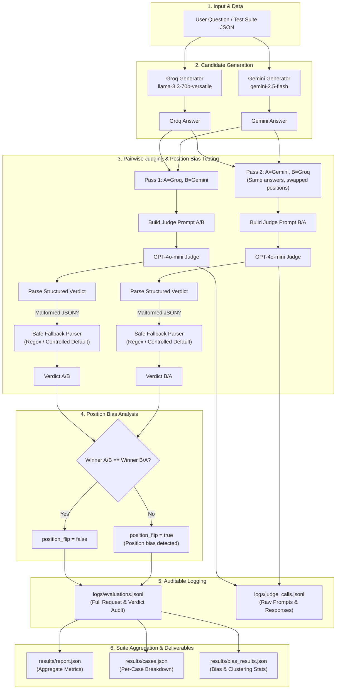

# Architecture & Pipeline Flow

This document details the architectural design and end-to-end execution flow of the **LLM-as-Judge Evaluation Pipeline**.

---

## 🏗️ System Overview Diagram



---

## 🔄 End-to-End Pipeline Execution Steps

```
[Test Suite JSON]
       │
       ▼
[Load Question]
       │
       ├──────────────────────────┐
       ▼                          ▼
[Groq Generator]          [Gemini Generator]
       │                          │
       ▼                          ▼
 [Groq Answer]            [Gemini Answer]
       │                          │
       └────────────┬─────────────┘
                    ▼
       ┌──────────────────────────┐
       │   Pass 1: A=Groq, B=Gemini│
       └────────────┬─────────────┘
                    ▼
       [GPT-4o-mini Judge (A/B)]
                    │
                    ▼
     [Parse Structured Verdict (5 Criteria)]
                    │
                    ├──── Successful ──► [Verdict A/B]
                    │
                    └──── Malformed ───► [Fallback Parser] ──► [Verdict A/B]
                    │
       ┌────────────┴─────────────┐
       │   Pass 2: A=Gemini, B=Groq│  (Same answers, swapped positions)
       └────────────┬─────────────┘
                    ▼
       [GPT-4o-mini Judge (B/A)]
                    │
                    ▼
     [Parse Structured Verdict (5 Criteria)]
                    │
                    ├──── Successful ──► [Verdict B/A]
                    │
                    └──── Malformed ───► [Fallback Parser] ──► [Verdict B/A]
                    │
                    ▼
        [Position Bias Comparison]
          winner_ab == winner_ba ?
                    │
                    ▼
       ┌────────────┴─────────────┐
       │     Auditable Logging    │ ──► logs/evaluations.jsonl
       │                          │ ──► logs/judge_calls.jsonl
       └────────────┬─────────────┘
                    ▼
        [Suite Metric Aggregation]
                    │
                    ├──► results/report.json
                    ├──► results/cases.json
                    └──► results/bias_results.json
```

---

## 🛠️ Component Breakdown & Module Mapping

| Flow Step | Module / File | Responsibility |
|---|---|---|
| Question Input | `data/questions.json` | 20 fixed test suite questions across coding, reasoning, system design, security, etc. |
| Candidate Generation | `app/llm.py` | Parallel async generation via Groq (`generate_groq_answer`) and Gemini (`generate_gemini_answer`). |
| Judge Call | `app/llm.py` | Sends structured system & user prompts to `gpt-4o-mini` with temperature=0.0. |
| Structured Verdict Parsing | `app/llm.py` (`parse_judge_response`) | 4-stage parser: JSON parse -> key normalization -> regex extraction -> controlled default fallback. |
| Position Bias Swap | `app/judge.py` (`_judge_answers`) | Evaluates A/B then B/A using identical pre-generated answers. Calculates `position_flip`. |
| Audit Logging | `app/logger.py` | Appends request records to `logs/evaluations.jsonl` and raw judge prompts to `logs/judge_calls.jsonl`. |
| Suite Aggregation | `app/metrics.py` | Computes win rates, 5-criterion mean scores, score clustering std dev, and position flip rates. |
| Results Deliverables | `results/` | Output directory containing `report.json`, `cases.json`, `bias_results.json`, `validation_results.json`, and `ab_comparison.json`. |
